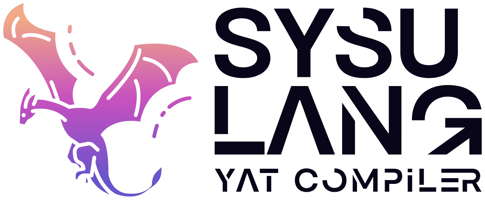
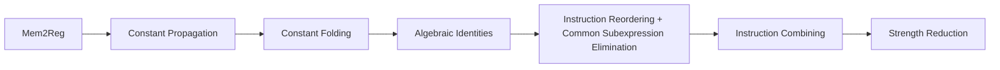

<p align="center">
  
</p>

# SYsU-lang 
**(Compiler Components in the “SYSU_ArchLang” Project)**

## 1. Introduction

In this project, we designed and built a front-end and middle-end compiler capable of translating a C-like language into optimized LLVM Intermediate Representation (LLVM IR). The compiler encompasses several key components, including lexical analysis, syntax analysis, semantic analysis, intermediate code generation, and intermediate code optimization. By implementing these stages, we ensured efficient parsing and transformation of source code, resulting in highly optimized machine-level instructions.

## 2. Project Description

The project is primarily composed of four parts:

#### (1) Lexical Analysis

Write regular expressions and use ANTLR to perform lexical analysis, converting the input code into tokens. This part achieves the same results as Clang‘s lexical analysis. The core code logic is implemented in `task/1/antlr`.

#### (2) Syntax Analysis and Semantic Analysis

Write a context-free grammar, use ANTLR to construct an AST, then reconstruct the AST into an ASG and obtain the symbol table, completing the syntax and semantic analysis. The core code logic is implemented in `task/2`.

#### (3) Intermediate Code Generation

Implement an intermediate code generator. The input to the program is the output from the previous part, which is the abstract syntax tree in JSON format, and the output is LLVM IR. This process is achieved by calling LLVM IR-related interfaces. The core code logic is implemented in `task/3`.

#### (4) Intermediate Code Optimization

Based on the previous part, an LLVM IR optimizer is implemented to optimize the results of the intermediate code generation, and multiple tests are conducted to ensure the correctness of the code during this process. In this laboratory, multiple Transform Passes are implemented to optimize LLVM IR. The core code logic is implemented in `task/4`.

The Transform Pass and the order of execution are shown in the diagram below:



## 3. Setup and Configuration

We provide ready-to-use standardized development containers. [This article](https://arcsysu.github.io/SYsU-lang2/#/introduction/environment) explains how to pull and use them on your computer. If you can use GitHub Codespaces, a simple and quick way to experience it is to directly click the `Code` button at the top right of the repository to create a Codespace with one click. After a short wait, you can start using it immediately.

If you prefer not to use containers and want to use this framework directly in your own Linux environment, please use the following bash commands:

```bash
# install
sudo apt-get update
sudo apt-get install -y build-essential git cmake ninja-build default-jdk \
  python3 bison flex
# clone
git clone https://github.com/arcsysu/SYsU-lang.git -b main --single-branch --depth 1

cd SYsU-lang
cd antlr && bash install.sh
cd ../llvm && bash install.sh
```

Then, use VSCode's Remote - SSH extension to connect to your Linux environment, open the repository folder, and start the laboratory.

All necessary VSCode extensions are listed in [`.vscode/extensions.json`](.vscode/extensions.json). When you open the folder, VSCode will automatically prompt you to install these extensions. Simply click the prompt to install them.
